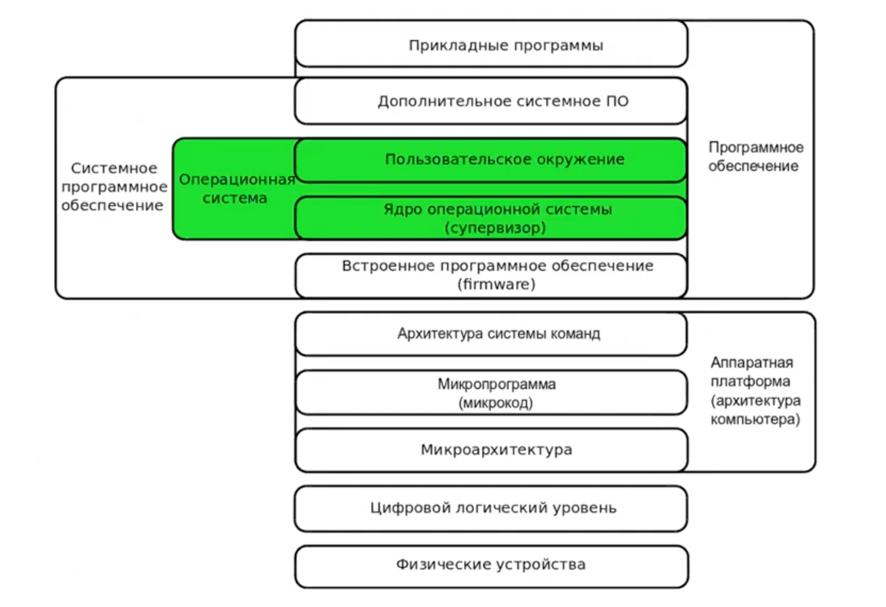
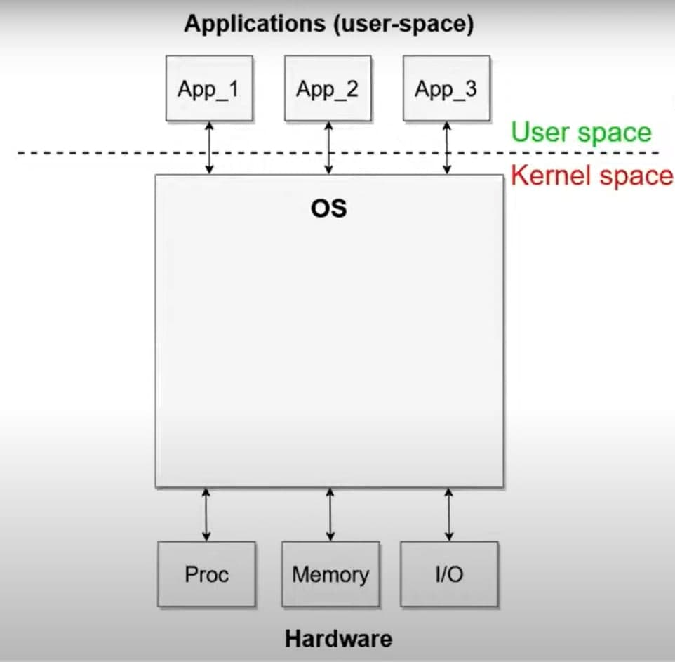
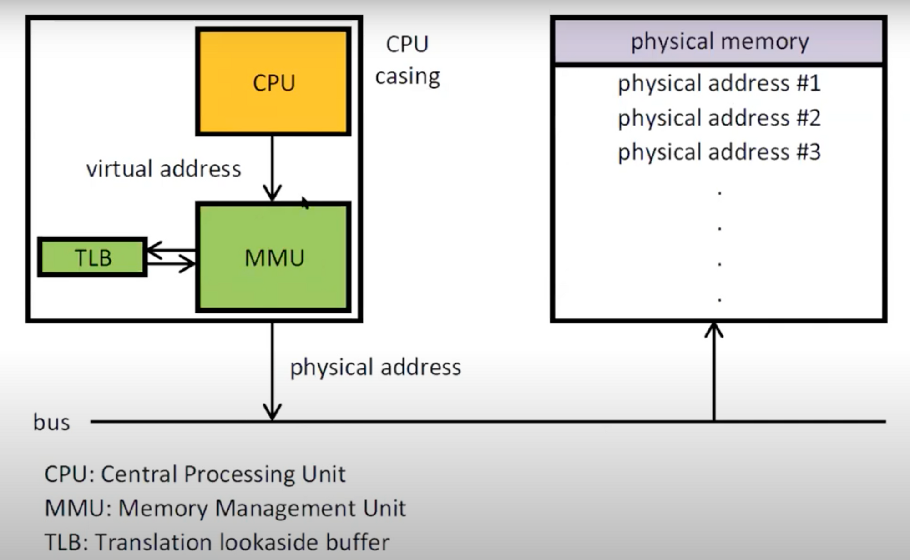
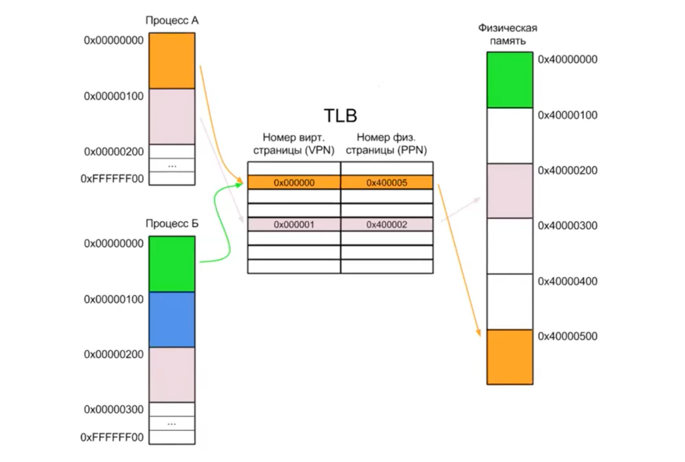

# CAOS_cheatsheet

## Лекция 4 (19/11/2021): кое-что про ядро, виртуальную память и внутренности процессора

### Как устроены компьютеры



У нас появляется много разных компьютеров, для каждого из них надо полностью читать руководство и заново писать программы

Мы хотим запустить написанные программы на другом компьютере, у которого своя система команд

1. Внезапно возникает желание провести какую-то унификацию
    
    ⇒ возникает необходимость в **абстракции доступа к устройству**
    
    В какой-от степени мы можем абстрагироваться от команд процессора и деталей организации памяти, если будем писать на языке уровнем повыше и его компилировать в те самые машинные команды, которыми мы до сих пор пользовались
    
    Но это не спасает нас от необходимости в каком-то слое абстракции, который взаимодействует с устройством
    
2. Компьютер большой и мощный, приходит много разных пользователей, каждый хочет запустить свою задачу. Мы хотим, чтобы компьютер мог одновременно выполнять несколько задач
    
    ⇒ для этого нужен кусок ПО, который будет переключаться между этими задачами
    
    Нарезаем время на какие-то кванты и переключаемся между разными задачами — разделение времени
    
    **Квотирование ресурсов**
    
3. Если все эти задачи выполняются разными пользователями на каких-то разных ресурсах, мы хотим каким-то образом ограничивать доступ разных пользователей к разным ресурсам
    
    У одной программы своя память, у другой программы — свой участок памяти, хочется, чтобы они друг другу не мешали
    
    ⇒ возникает необходимость в **разграничении доступа**
    

Итог: мы пишем какой-то комплекс ПО, который будет этими вещами заниматься

В каких-то ограниченных средах исполнения это может работать, но как только мы делаем компьютер общего назначения, на котором работает множество пользователей, каждый из которых пишет свою прикладную программу, это работать перестает

⇒ мы вынуждены добавлять в систему какие-то средства принуждения (enforcement), то есть средства обеспечения разграничения доступа и квотирования, которые необходимы ОС

⇒ для этого требуется аппаратная поддержка со стороны того компьютера, на котором мы исполняемся

А именно, мы берем и выделяем некоторую часть ПО и говорим, что хотим, чтобы эта часть ПО выполнялась в привилегированном режиме

⇒ возникает два режима работы процессора (и компьютера, в целом): **непривилегированный** (в котором, в частности, работают прикладные программы; в нем мы подвержены различным ограничениям и не можем никак на них влиять) и **привилегированный** (то ПО, которое в нем исполняется, может устанавливать ограничения, изменять их, то есть устанавливать правила для непривилегированных программ) 

Традиционно, та часть ПО, которая исполняется в привилегированном режиме (режиме супервизора), называется **ядром ОС**

Как нам все это организовать?

Понятно, что для этого требуется поддержка со стороны процессора

Например, в процессоре x86 есть дополнительные регистры, на которые мы еще не смотрели (**контрольные регистры**), в которых записан текущий режим работы процессора

Привилегированный ⇒ можем менять значение в контрольном регистре, что-то записать в него

Непривилегированный ⇒ не можем ничего записать в контрольном регистре


Появляется разделение на user space (пользовательский, непривилегированный) и kernel space (режим ядра, режим супервизора, привилегированный)


На этой картинке получается, что вся ОС исполняется в режиме ядра, хотя мы понимаем, что есть части ОС, которые исполняются в непривилегированном режиме — например, **динамический загрузчик** (берет файл программы и загружает его в память, добавляет к нему библиотеки) исполняется в user space, но фактически является частью ОС, и **конфигурационные файлы**, которые выполняют первоначальную настройку системы при загрузке (понятно, что их интерпретирует user space, при этом они явно являются частью ОС, то есть не относятся к прикладным программам)

Что мы видим на этой картинке?

Весь ввод-вывод возлагается на ядро

На прошлой лекции мы уже видели, как обращаться к ядру

Системные вызовы — один из механизмов взаимодействия между kernel space и user space

Когда мы пользуемся системным вызовом в нашей программе, которая исполняется user space, процессор сохраняет состояние нашей программы (текущий счетчик программы — регистр %eip, состояния регистров), переключается в привилегированный режим и начинает исполнять какой-то код ядра ОС, который призван обработать этот системный вызов

Ядро заранее настраивает процессор таким образом, чтобы в этом случае передавать исполнение на нужные участки ядра

Ядро обработало ваш системный вызов

Допустим, мы хотим что-то считать с устройства и обратились с этой услугой к ядру, оно берет данные, которые удалось прочитать, кладет их в память по тому адресу, который вы указали ядру, и возвращается из системного вызова, переключая процессор обратно в непривилегированный режим и предварительно восстановив значения регистров, которые у вас были (в том числе, регистр %eip)

Исполнение программы продолжается, а мы даже не заметили, что что-то исполнилось в режиме ядра, — только у нас в памяти появились новые данные

Возникает следующий вопрос

У нас одна оперативная память на всю систему. Ничего не мешает любой программе взять и залезть в память к соседу. Мы замечали, что можем запустить несколько копий одной программы (адресы одинаковые, данные разные)

Объясняется это очень просто: взаимодействие с памятью тоже в каком-то смысле управляется ядром ОС (невозможно было бы программным образом отслеживать каждое обращение к памяти — это очень медленно)

Поэтому для этого тоже требуется какая-то специальная поддержка со стороны процессора, а именно в процессере должно быть специальное **устройство управления памятью (MMU)**, которое настраивается ядром ОС



Таким образом, перед тем как передать управление вашей прикладной программе, ОС настраивает MMU таким образом, чтобы у вас был доступ только к той памяти, к которой вы имеет право обращаться

Если вы обращаетесь к памяти, к которой не имеете права обращаться, то сам центральный процессор прерывает исполнение вашей программы точно так же, как и в случае системного вызова: сохраняет ее состояние и передает управление на специальный обработчик в ядре, а дальше ядро решит, что с вами делать

Как же конкретно устроена схема контроля обращений к памяти? (пикча слева)

Те адреса, которыми мы так успешно пользовались в наших программах на языке ассемблера, не имеют прямого отношения к адресу физической памяти. То есть, у нас есть физическая оперативная память, на ней есть некая адресация памяти (как на машине Фон Неймана). Любой байт из физической памяти может прочитать (записать) ядро

Для пользовательских программ мы придумываем новые виртуальные адреса и неким образом транслируем их в адреса физической памяти 

Каждый раз, когда мы создаем какую-то программу, у нас запускается **процесс**

У каждого процесса есть собственные состояние исполнения, счетчик команд (instruction pointer) и отображение виртуальной памяти на физическую

В большинстве эксплуатируемых компьютеров (в том числе, x86) это отображение делается отдельно для блоков памяти размером 4КБ (4096 байт)

Каждый такой блок называется **страницей памяти**



Нарисовала два процесса
Для каждой страницы виртуальной памяти MMU поддерживает отображение номер виртуальной страницы → номер физической страницы (таблица страниц)

Процессор смотрит в таблицу виртуальных страниц, если есть соотвестввие, то записать значени е в физическую память. Если же записи никакой нет, процессор отдает управление ОС.


#### Окей, посмотрим в терминале

Посмотрим на виртуальное адресное пространство с точки зрения какой-то отдельной программы.


Мы запустили программу ⇒ возник процесс

**Процесс** — это сущность ядра ОС, которая соответствует одному запуску какой-то программы

```bash
ps afx | less  # посмотреть на процессы в системе 
```