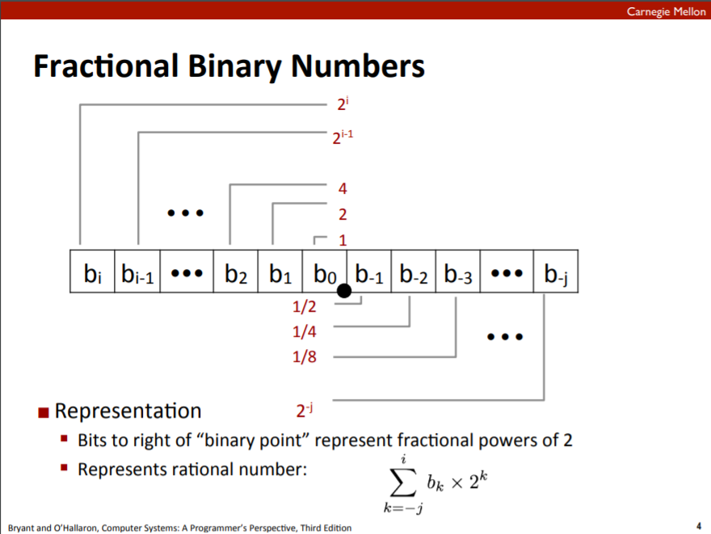
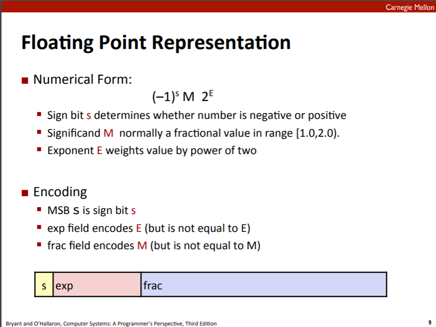
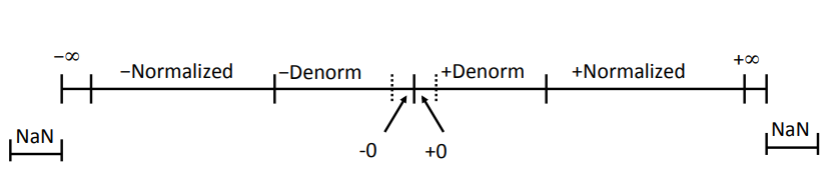

# CAOS_cheatsheet

## Лекция 9 (14/01/2022): вещественные числа

> [Крутая презентация](l9-floating-point.pdf)

### Двоичная дробь

**Что такое 1011.101_2?**



Из-за этого появляется следующие ограничения:

1. Мы умеем точно представлять числа в виде `x/2^k`
2. Не все числа мы умеем представлять точно, например, трудности уже возникают даже с 0.1
3. Сложности с очень большими или очень маленькими числами, если точка фиксирована


Поэтому мы приходим к идеологии "плавающей точки" *(floating point)*.

### Floating point

Стандарт представляет числа так:



Тогда, например:

1. Single precision: s -- 1 бит, exp -- 8 бит, frac -- 23 бит
2. Double precision: s -- 1 бит, exp -- 11 бит, frac -- 52 бит
3. Extended precision (только Intel): s -- 1 бит, exp -- 15 бит, frac -- 63 или 64 бит


#### Типы вещественных чисел:

1. **Нормализованные** *(normalized)* -- ведущая единица, `exp != 0...0` и `exp != 1...1`
2. **Денормализованными** *(denormalized)* -- `exp = 0...0`, это числа очень близкие к нулю, порядок `2^{-38}^`
3. **inf** -- числа, у которых `exp = 1...1` и `frac = 0...0`
4. **NaN** *(Not a Number)* -- числа, у которых `exp = 1...1`

> [Посмотреть на представление чисел с плавающей точкой](https://www.h-schmidt.net/FloatConverter/IEEE754.html)




#### Соглашения в IEEE Encoding:

1. Floating point 0 то же самое, что и integer 0

    - Просто все биты равны 0

2. Почти всегда можно использовать сравнение как целых

    - Сначала нужно сравнить знаковые битным
    - -0 = 0
    - NaN -- это проблема, будет всегда больше остальных значений
    - Остальное норм


### Операции в вещественных числах

Что хочется вообще?

- Чтобы компьютер сначала посчитал точных результат
- А уже потом уложил его в желаемое представление
    - если слишком большая exp, то overflow
    - дробную часть **округляем**


#### Как выглядит округление? Выделяют 4 варианта округления:

1. *Округление к нулю*
2. *Округление вверх*
3. *Округление вниз*
4. *Округление к ближайшему четному (default):* идея в том, чтобы не было накапливания ошибок в какую-то одну сторону, поэтому хочется иногда округлять в большую сторону, а иногда в меньшую.
    **Всё округляем математически кроме половинок (e. g. 1.5, 2.5, -1.5):**
    - 1.5 -> 2
    - 2.5 -> 2
    - -1.5 -> -2
    - 7.885 -> 7.88
    - 7.895 -> 7.90

#### Умножение 

Точный результат:

- Sign s: s1 ^ s2
- Significand M: M1 * M2
- Exponent E: E1 + E2

Свойства:

1. Коммутативность сохраняется
2. Ассоциативности нет
3. При умножении на 1 не изменяется
4. Дистрибутивности нет
5. Монотонность сохраняется (a >= b => a + c >= b + c), кроме inf и NaN


#### Сложение 


1. Сдвигаем так, что плавающая точка на одном и том же месте
2. Складываем мантиссы
3. Новая экспонета равна наибольшей экспоненте двух слагаемых

Свойства:

1. Коммутативность сохраняется
2. Ассоциативности нет
3. При прибавлении 0 не изменяется
4. У каждого элемента есть обратный по сложению, кроме inf и NaN
5. Монотонность сохраняется (a >= b => a + c >= b + c), кроме inf и NaN


### В языке C 

1. Гарантия двух уровней точности:
    - `float` -- это single precision
    - `double` -- это double precision
    
    Большее зависит от компилятора
2. Conversions/Casting
    - double/float -> int
        - дробная часть отбрасывается
        - как округление к нулю
        - Округление NaN -- это Undefined Behaviour
    - int -> double
        - точно, пока int <= 53 бита
    - int -> float
        - округлится в соотвествии с выбранным режимом округления

#### Примеры конвертаций:
Пусть x = int, f = float, d = double и f и double не NaN

- `x == (int) (float) x` -- не всегда
- `x == (int) (double) x` -- то же самое получим
- `f == (float) (double) f` -- то же самое 
- `d == (double) (float) d` -- не всегда 
- `f == -(-f)` -- то же самое
- `2/3 == 2/3.0` -- не всегда


### Итог

1. У IEEE Floating point ясные математические свойства
2. Представляется числа вида `M * 2^E`
3. Не всегда точное представление чисел
3. Не то же самое, что и сложение обычных вещественных чисел
    - Нет ассоциативности и Дистрибутивности


### Математическая библиотека языка C 

Проверка на то, каким является число с плавающей точкой:

- `int isnan(x)`
- `int isfinite(x)`
- `int isnormal(x)`
- `int isinf(x)`
- `int fpclassify(x)` -- обобщающая функция всех функций выще, которая возвращает, каким является вещественное число


- `int signbit(x)` -- возвращает знак
- `int isgreater(x)`

### Задачи

Напишем программу, которая будет узнавать **знак числа и экспоненты**:

```c
union ufloat {  // как struct, но члены хранятся на одном и том же месте в памяти
    unsigned u;
    float f;
};
// в данном случае мы пользуемся тем, что на 32-битной платформе и unsigned, и float 32-битные

union ufloat uf;
scanf("%f", &uf.f);
printf("sign bit: %d\n", uf.u >> 31);
printf("exp: %d\n", uf.u >> 23);  // неверно для отрицательных
```

**Сумма элементов в массиве:**

1. Удаляем NaN, если есть
2. Сортируем массиве
3. Пытаемся учитывать и сумму, и накопившуюся ошибку -- таким образом точность в два раза выше

> [Подробности](https://en.wikipedia.org/wiki/Kahan_summation_algorithm)

**Быстрый алгоритм вычисления обратной величины к квадратному корню**

> [Видео об этом](https://www.youtube.com/watch?v=p8u_k2LIZyo)

Один из вариантов: метод Ньютона


### Как работа с вещественными числами реализована в процессере

- Если плавающей точки нет, то заменяется фиксированной точкой или программым вычислением
- X86/x64 два *разных* устройства для вычислений с плавающей точкой

В 90тые годы было устройство, работающее с плавающей точкой **FPU**.

- 8 регистров размера 80 бит (т.е. long double), организованных в стек: `%st(0)`, `%st(1)`, ..., `%st(7)`
- Загрузка из памяти: `fld`
- Сохранение в память: `fst`
- Разные вычисления: `fadd`, `fsub`, `fsin`, ... 

С какого-то момента перестало хватать, хочется выполнять операции быстро, при этом операции производятся над разными данными. Как следствие, хочется, чтобы процессор умел в некоторую параллельность.

Сейчас есть регистры **SSE, SSE2, ...**

- набор `SIMD`
- Другой пример: вычисления на GPU
- Обрабатывается несколько однотипных наборов данных

- X86: 8 регистров `%xmm0 — %xmm7` — 128 бит. Таким образом, регистр может содержать:
    - 2 числа типа double
    - 4 числа типа float
    - 2 64-битных целых числа
    - 4 32-битных целых числа
    - 8 16-битных целый чисел
    - 16 8-битных целых чисел
- X64: 16 регистров `%xmm0 — %xmm15`
- AVX: 256-битные регистры `%ymm`
- `%mxcsr` -- регистр статуса
- Все регистры -- scratch 
- на x64 в `%xmm` передаются параметры, в `%xmm0` возвращается результат


Так же:
- Операции выполняются как правило над всеми числами за раз
- Для %ymm в два раза больше значений обрабатывается одновременно
- Можно использовать для обычных (скалярных) операций


#### Выравнивание
Для того, чтобы команды работали быстрее (чтобы стек был выравнен), чтобы быстрее выгрузить команды

- **MOVDQA** — загружает значение XMM из памяти целиком (128 бит)
- **PADDD** — складывает два вектора из 4 32-битных значений в XMM регистрах и памяти
- У подобных инструкций адрес памяти должен быть выровнен по 16
- Иначе — Segmentation fault

Собираем с `-mfpmath=sse`, чтобы использовать набор инструкций SSE:
```bach
gcc main.c -m32 -lm -msse4 -mfpmath=sse 
```)